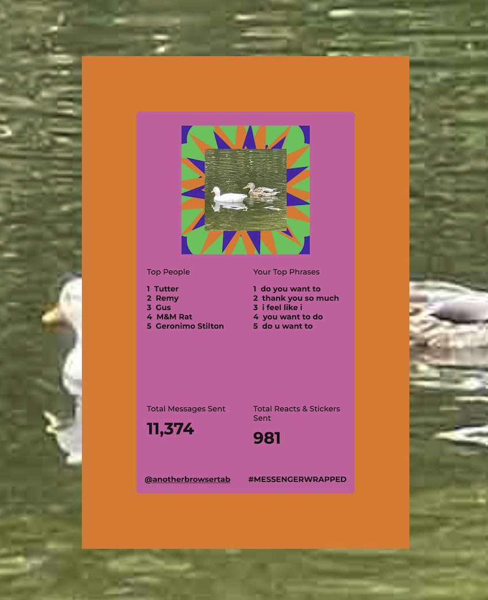

# 2022 Messenger Wrapped
by [@anotherbrowsertab](https://www.instagram.com/anotherbrowsertab/)

Get your Spotify Wrapped for Facebook Messenger!
- **Top People/Top # Messages Others Sent**: either the names of the people (max 5) who sent you the most messages this year, or the number of messages that each of those people sent you this year.
- **Your Top Phrases**: phrases (max 5) that appeared the most in the messages you sent.
- **Total Messages Sent**: the total number of messages sent by you (and anyone else sharing your name on Facebook that sent you messages).
- **Total Reacts & Stickers Sent**: the total number of reactions used and stickers sent by you (and anyone else sharing your name on Facebook that sent you messages).

[Originally built in 2020](https://github.com/tiffanyq/2020-messenger-wrapped) and refreshed for 2022! I built this to look through my own Messenger data after seeing lots of 2020 Spotify Wrapped data floating around. The process is a bit involved but this is to avoid needing to upload your Messenger data somewhere.

## To run Messenger Wrapped, you will need:
- Python 3
- Internet browser e.g. Chrome, Firefox, Safari (these are just the browsers I have tested so far!)
- some sort of terminal, command shell, etc to run the Python script in

## Messenger Wrapped uses the following external resources:
- [Google Fonts](https://fonts.google.com/) - provides the font Montserrat
- [p5.js](https://p5js.org/) - used to generate shapes for profile picture and background

## How to use Messenger Wrapped
1. Download your Facebook Messenger data for the past year.
- To get to "Download Your Information" on Facebook: On desktop, select your profile picture icon in the top right corner > Settings & Privacy > Settings > Privacy > Your Facebook Information > Download profile information
- Under "Select file options":
  - Set "Format" to JSON.
  - Set "Media Quality" to Low (no code references attached media, but this should speed up download times and reduce file sizes).
  - Set Date range to "Last year".
- Under "Select information to download":
  - Deselect all.
  - Reselect "Messages".
  - Scroll all the way down and click "Request a download". It may take a while for Facebook to prepare the file. I received a Facebook notification when my data was ready for download.

2. Download your Facebook Messenger data once it's available and unzip the file.

3. Pull this repository. Move your extracted Facebook data folder (AFTER extraction, mine was named `messages`) inside the `2022-messenger-wrapped` directory. The directory should then look like:
- `generate_messenger_wrapped.py`
- `index.html`
- `README.md`
- `css/`
- `js/`
- `messages/`

4. In the `2022-messenger-wrapped` directory, run `generate_messenger_wrapped.py` in your terminal. (e.g. `python generate_messenger_wrapped.py`, `python3 generate_messenger_wrapped.py`, etc)
- This script will ask for several inputs:
  - **Your name as used on Facebook/Messenger**. This is so that your name is recognized while going through your data so that messages, reactions, and stickers are properly attributed (or not attributed) to you.
    - Capitalization and whitespace/spaces matter.

  - **The names of any senders you would like to omit from your list of top senders**, separated by commas.
  
  - **Whether or not you want to include group chat messages when identifying your top senders**. If you indicate no, only chats between 2 participants (you and some other person) will be used to identify your top senders.
  
  - **The length of your top phrases that you would like to look for in messages you sent, measured by number of words**. This must be a number between 3 and 6 inclusive. The default number of words in a phrase is 4.
  
  - **Any phrases you would like to omit from your list of most commonly used phrases**, separated by commas. Please omit punctuation from these phrases. If any of these phrases are found in a message that you send, that entire message will be ignored when counting up your most frequently used phrases.
  
  - **If you'd like to view the names of the 25 people who sent you the most messages as found in your data**, in the format `(name, total number of messages that person sent you)`. If you indicate yes, it will print out those names sorted from most messages sent to least messages sent.
    - I don't think this script differentiates between different people who use the same display name on Facebook :(

  - **Which you would prefer to share in your Messenger Wrapped file**: the *names* of the 5 people who sent you the most messages this year, or the *number of messages sent* by the 5 people that sent you the most messages this year. Type "names" to share the names, and type anything else to share the numbers instead.
 
  - **If you'd like to view your top 100 phrases**, in the format `(phrase, total number of occurrences)`. If you indicate yes, it will print out those phrases sorted from highest to lowest frequency.

5. In the `2022-messenger-wrapped` directory, open `index.html` to view and screenshot your Messenger Wrapped image! The profile picture and background design are generated each time you refresh the page—try it out :)
